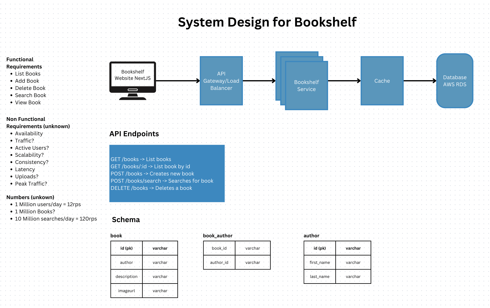

# System Design

It was not in scope but if I were to own this project this would be my backend infrastructure at a high level, considering non functional requirements are unknown.

1. **Functional requirements.** We got some requirements in the initial doc, I added some extra that can help improve the UX.
2. **Non-Functional requirements.** They are unknown so it's difficult to prepare a system design, I'm assuming some numbers here.
3. **API Gateway/Load Balancer.** Some of the purposes of the apigateway:
  * Act as a proxy to server requests.
  * Security policies and rate limit.
  * Load balancer.
  * Canary releases.
4. **API Gateway/Load Balancer.** We could add a search box or filter options for better UX.
5. **Bookshelf service.** This is the main service for books, if we were to have other functionalities like payments, we would create another service here (payments or billing service).
6. **API endpoints.** These would be the API endpoints implemented based on functional requirements.
7. **Database** I would implement a relational database for the books, this may be a noSQL depending on non-functional requirements.
8. **Schema.** Based on functional requirements these are the only tables we need
  * book table to save book data.
  * author table to save author data.
  * book_author table, many to many relation between book and author tables, in real life a book can have many authors and an author can have many books.
